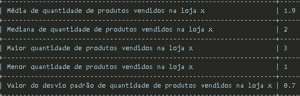
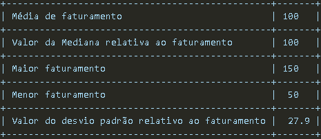
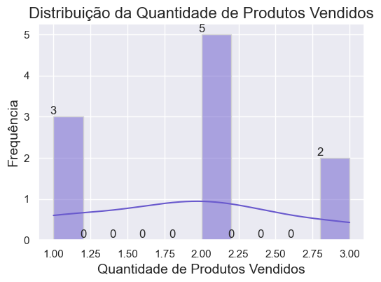
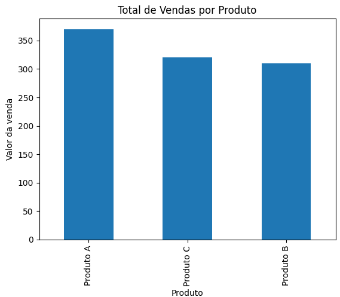
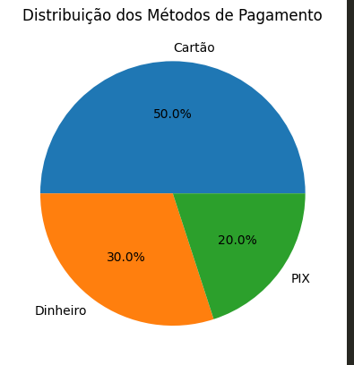

# Relatório de Vendas - Loja X

## Análise Estatística Descritiva de Vendas 📈🛒

Este relatório apresenta uma análise detalhada dos valores das vendas de uma empresa de varejo. 

O foi calcular estatísticas descritivas importantes como média, mediana, mínimo, máximo e desvio padrão dos valores de venda.

Além disso, foi criado um histograma para visualizar a distribuição dos valores das vendas, oferecendo insights visuais sobre a variabilidade dos dados.

Vamos explorar os resultados dessa análise e suas implicações para o desempenho de vendas da empresa.

## Análises

*   A base de dados ilustrou as vendas realizadas nos 10 primeiros dias no mês de janeiro de 2023.

### Dados estatísticos relativos à quantidade de produtos vendidos e ao faturamento no período

            * Com relação ao faturamento observa-se que:

                - O faturamento médio das vendas é de 100 unidades monetárias. 
                - Tanto a mediana quanto o maior valor de faturamento também são de 100 unidades - distribuição relativamente simétrica dos dados. 
                - O menor faturamento registrado foi de 50 unidades e Desvio padrão de 27.9 - dispersão moderada em torno da média: pode haver variabilidade nos resultados das vendas ao longo do período analisado 

### Análise de distribuição da quantidade de produtos vendidos

### Análise de Vendas por Produto

            * Uma análise inicial aponta que o Produto A é o mais popular ou tem maior demanda;
            * Isso pode indicar que o Produto A pode ser um item de alto interesse ou de maior aceitação no mercado;
            * Os produtos C e B também têm vendas sólidas, mas em menor quantidade.

### Análise de quantidade de vendas por região

            * Nesta análise observa-se que a região Norte tem maior volume de vendas, indicando aí uma demanda maior ou mercado mais aquecido.
            * Para analisar de forma mais substancial, deve-se considerar fatores como: população, economia local, concorrência, estratégias de vendas, etc. 

### Análise de métodos de pagamento

            * Pagamento com cartão é o método mais popular, representando metade das transações. 
            * Pode ser uma preferência por conveniência, segurança ou benefícios.
            * Pagamento em dinheiro ainda é significativo, reflettindo uma preferência por liquidez imediata ou possibilidade de descontos nas compras.
            * O pix mostra aí uma tendência de modernização nos hábitos de consumo, com mais clientes adotando tecnologias de pagamento digital.

## Conclusão

* Esta análise destaca padrões nas vendas por produto, região e métodos de pagamento, proporcionando insights para ajustes estratégicos e otimizações futuras. 

